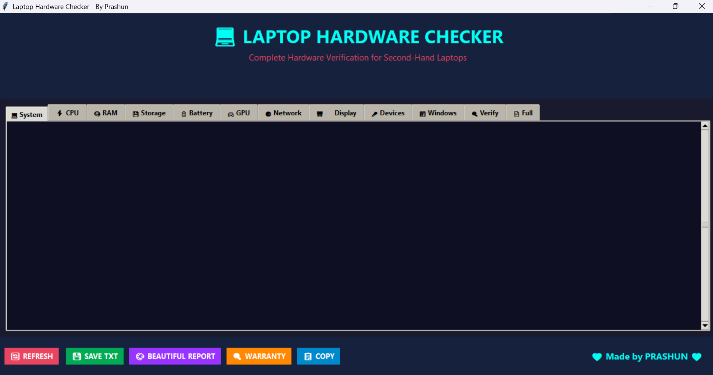
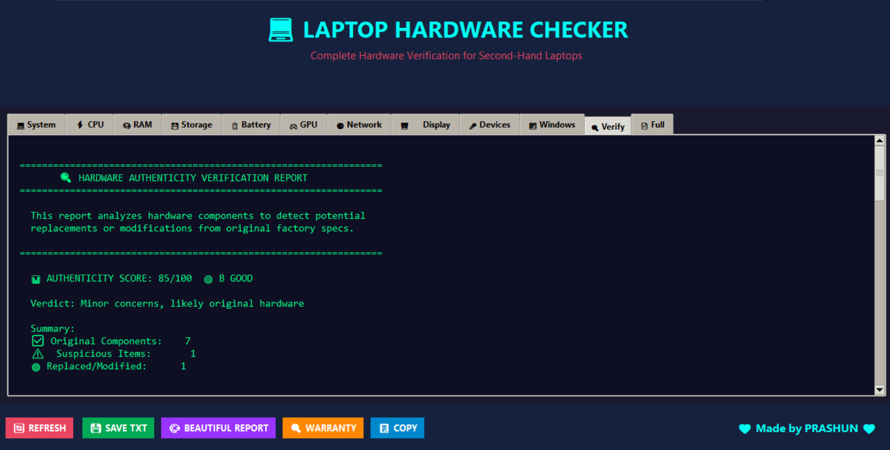
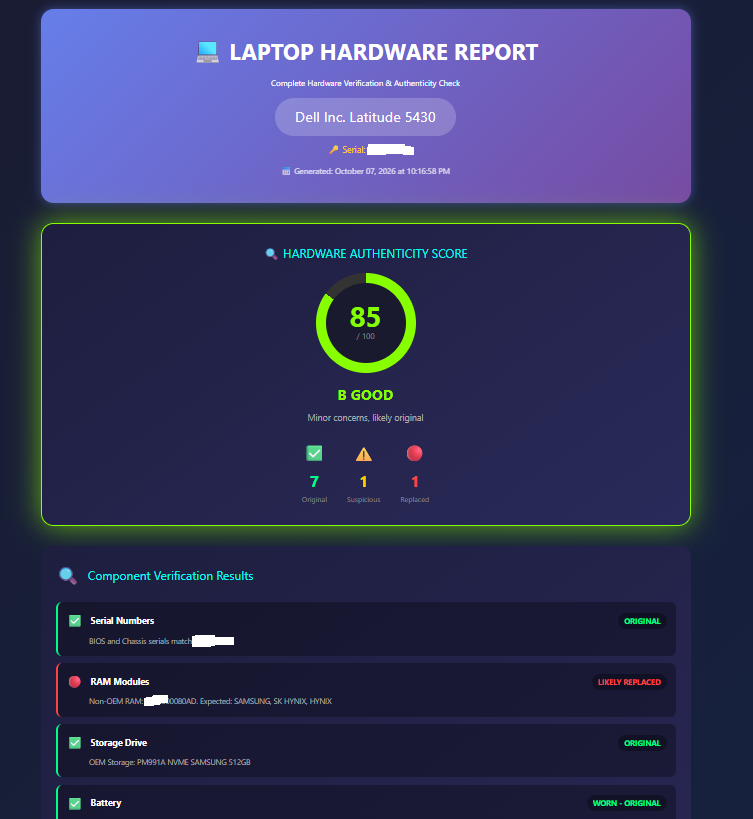

# 💻 Laptop Hardware Checker

[](https://www.python.org/downloads/)
[](https://www.microsoft.com/windows)
[](LICENSE)

> **Complete Hardware Verification Tool for Second-Hand Laptops**

A powerful Windows application that scans and verifies laptop hardware components, detects replaced/modified parts, and generates beautiful HTML reports.



---

## ✨ Features

### 🔍 Hardware Detection

- **System Info** - Manufacturer, Model, Serial Number, BIOS
- **CPU** - Processor details, Cores, Threads, Speed, CPU ID
- **RAM** - Total memory, Individual sticks, Manufacturer, Speed
- **Storage** - All drives, Partitions, Usage statistics
- **Battery** - Health percentage, Cycle count, Design vs Current capacity
- **GPU** - Graphics cards, VRAM, Driver version
- **Network** - All adapters, MAC addresses, IP
- **Display** - Resolution, Refresh rate, Touch screen detection
- **Devices** - Webcam, Bluetooth, Audio devices

### 🛡️ Hardware Authenticity Verification

Detects potentially replaced or modified components:

| Check          | Detection                                    |
| -------------- | -------------------------------------------- |
| Serial Numbers | BIOS vs Chassis mismatch                     |
| RAM Modules    | OEM vs Aftermarket (Crucial, Kingston, etc.) |
| Storage Drive  | OEM vs Aftermarket SSD                       |
| Battery        | New battery on old system                    |
| Windows        | Fresh installation detection                 |
| BIOS           | Modified firmware                            |
| Network Card   | Replaced WiFi adapter                        |
| Display Panel  | Aftermarket screen                           |

### 📊 Authenticity Score

- **90-100**: A+ Excellent - Mostly original
- **75-89**: B Good - Minor concerns
- **60-74**: C Fair - Some parts may be replaced
- **40-59**: D Suspicious - Multiple replacements
- **0-39**: F Poor - Significant modifications

### 📄 Report Generation

- **TXT Export** - Plain text report
- **HTML Report** - Beautiful, animated, printable report
- **Clipboard Copy** - Quick copy for sharing
- **Warranty Lookup** - Direct links to manufacturer warranty pages

---

## 🖼️ Screenshots

### Main Interface


### Verification Tab



### HTML Report



---

## 🚀 Installation

### Option 1: Run Python Script

1. **Requirements**
   - Windows 10/11
   - Python 3.7+

2. **Clone the repository**
   ```bash
   git clone https://github.com/YOUR_USERNAME/Laptop-Hardware-Checker.git
   cd Laptop-Hardware-Checker
   ```
3. Run the application
   bash
   python laptop_checker.py
   Option 2: Download Executable
   Download the latest .exe from Releases

🔨 Build Executable
powershell
pip install pyinstaller
pyinstaller --onefile --windowed --name="Laptop_Hardware_Checker" laptop_checker.py
The executable will be in the dist/ folder.

📋 Usage
Launch the application
Browse tabs to view different hardware information
Click "🔍 Verify" tab to see authenticity analysis
Click "🎨 BEAUTIFUL REPORT" to generate HTML report
Click "🔍 WARRANTY" to check manufacturer warranty
🛠️ Technical Details
Language: Python 3
GUI Framework: Tkinter
Data Collection: Windows WMI (PowerShell)
Report Format: HTML5 with CSS3 animations
WMI Classes Used
Win32_ComputerSystem
Win32_BIOS
Win32_Processor
Win32_PhysicalMemory
Win32_DiskDrive
Win32_Battery
Win32_VideoController
Win32_NetworkAdapter
BatteryFullChargedCapacity
BatteryStaticData
And more...
⚠️ Disclaimer
This tool provides software-based detection only
Physical inspection is still recommended
Some OEM parts may not be detected correctly
A "replaced" part is not necessarily bad (upgrades are common)
Always verify with original purchase invoice
🤝 Contributing
Contributions are welcome! Please feel free to submit a Pull Request.

Fork the repository
Create your feature branch (git checkout -b feature/AmazingFeature)
Commit your changes (git commit -m 'Add some AmazingFeature')
Push to the branch (git push origin feature/AmazingFeature)
Open a Pull Request
📝 License
This project is licensed under the MIT License - see the LICENSE file for details.

👨‍💻 Author
Prashun

GitHub: @YOUR_USERNAME
🙏 Acknowledgments
Thanks to everyone who tests and provides feedback
Inspired by the need for transparent second-hand laptop verification
⭐ Star History
If you find this useful, please ⭐ star this repository!

Made with 💜 by Prashun
